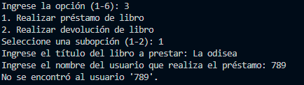

<!--notas-->
## Segundo Parcial

### Programación Orientada a Objetos

**Autor:** Munive Rosas Arturo Alberto

## Acerca de detalles para ejecutar el código y las entradas adecuadas para su manejo
Debido a las posibles dificultades que puede causar el presente proyecto, se ha proporcionado un manual en este repositorio que explica cómo utilizar el código y cómo manejarlo de manera eficiente. 

## Explicacion rapida de como funciona
La clase Autor actua con ser un diccionario utilizado para rastrear la información relacionada con los libros de un autor, pero relacionada directamente con la clase Libro porque de ahi obtinen sus atributos. La clase Biblioteca se utiliza para mantener una lista de libros y rastrear la información del autor.!
Hay que tener cuidado y orden a la hora de ir metiendo cada dato porque al no estar tan detallado pueden surgir errores, 

## Agregar
La mejor manera de usar este sistema es de manera ordenada. Por ejemplo, es más rápido agregar un usuario que será útil más adelante.

La forma de agregar un libro es la estándar, y es importante notar que se utiliza un 0 para las copias disponibles. En general, el valor no importa, pero es más formal comenzar con 0.

## Busqueda
A continuación, se explican varias opciones para buscar libros y sus diferencias. Puede repetir el proceso de agregar para simular una base de datos en memoria.

Realicemos una búsqueda y veamos sus opciones. Por ejemplo, si el usuario conoce el nombre del libro, es más fácil y mostrará más detalles. En caso de buscar por autor o género, es más práctico, ya que llevará a títulos de libros registrados.

Esto es útil si el usuario tiene una idea de lo que desea buscar. Si solo quiere ver todos los libros, hay una opción para listarlos. 
 

En caso de no saber que querer buscar autor o generos es mas practico la opcion 5 porque te llevara a titulos de libros que hay en el registro 

## Metodos de prestamos y devoluciones
Vamos a solicitar un préstamo. Para ello, debe haber ingresado más usuarios. Ten cuidado de no ingresar usuarios que no existen. 

 

Luego, procedemos a realizar una devolución. 
## Registro del usuario
Por último, el registro de usuarios es más rápido y sencillo, al igual que el proceso de devoluciones.

 y el de devoluciones 

Finalmente, aquí tienes una captura de pantalla de la salida del código: 