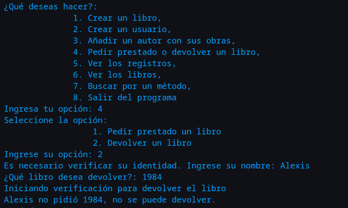

# Manual para el uso del proyecto de Gestión de Biblioteca

## Alexis Salgado Urtes

**Resumen:** dadas las [instrucciones](/Examen_Unidad_3_4_POO.pdf) del profesor, se han creado 5 clases (*basadas en las sugerencias del profesor*).
Su funcionamiento puede verse en en al archivo **main.py**.
Una vez que se llame al programa, se desplegará un menú con el cual podremos interactuar.
El menú deberá verse algo parecido a la siguiente imagen

A continuación el usuario creará un libro con los siguientes comandos **(Se omiten los títulos con tildes para menor complejidad)**

* ***1***
* ***vigilancia permanente***
* ***edward snowden***
* ***no ficcion***
* ***5***

Donde las entradas hacen referencia a *agregar un libro*, *título del libro*, *autor*, *género del libro* y *copias disponibles* respectivamente.
El menú despliega el tipo de dato que tiene que ingresar, por si el usuario quiere más referencias.
En la terminal el usuario podrá ver que el libro se agregó correctamente.

Lo siguiente es crear un usuario con su nickname.
A continuación el usuario deberá ingresar:

* ***2***
* ***alexis***

Donde las entradas hacen referencia a *crear un usuario* y *nombre del usuario*.

En la terminal podemos ver que nuestro usuario se añadió gracias al mensaje *El usuario se ha agregado*.

Posteriormente deberemos agregar un autor con sus obras.
Los comandos que usaremos son

* ***3***
* ***ernest hemingway***
* ***2***
* ***el viejo y el mar***
* ***novela***
* ***3***
* ***adios a las armas***
* ***novela***
* ***2***

Donde las entradas hacen referencia a *Añadir un autor con sus obras*, *nombre del autor*, *número de libros a crear*, *título del primer libro*, *genero del primer libro*, *copias disponibles del primer libro*, *título del segundo libro*, *género del segundo libro* y *copias disponibles del segundo libro*.
En la terminal podemos ver que el autor se añadió junto a sus obras.

Después pediremos un libro con los siguiente comandos

* ***4***
* ***1***
* ***alexis***
* ***vigilancia permanente***

Donde las entradas hacen referencia a *Pedir prestado o devolver un libro*, *Pedir prestado un libro*, *nombre del usuario para la verificación* y *nombre del libro a prestar*.
Veremos que el libro se prestó correctamente desde la terminal.

Una vez prestado el libro, podremos ver los registros con los siguientes inputs.

* ***5***
* ***1***

Donde las entradas hacen referencia a *Ver los registros* y *Ver los préstamos*.

Podemos ver que, en efecto, se registró nuestro préstamo.
El siguiente paso será ver los libros que se han registrado en la biblioteca. Deberíamos encontrarnos con el libro de Snowden y los de Hemingway.
Lo verificamos con los siguientes inputs.

* ***6***

Donde la entrada hace referencia a *Ver los libros*.
Vemos que, en efecto, se muestran los libros.

Vemos que se nos muestra el título, el autor, el género y las copias disponibles.

Podemos devolver el libro con los siguientes inputs.

* ***4***
* ***2***
* ***alexis***
* ***vigilancia permanente***

Donde las entradas hacer referencia a *Pedir prestado o devolver un libro*, *devolver un libro*, *nombre del usuario para la verificación* y *nombre del libro a devolver*.

Finalmente, vemos que podemos buscar por algúnos métodos. Buscaremos por género con los siguientes inputs.

* ***7***
* ***1***
* ***novela***

Donde las entradas hacen referencia a *Buscar por un método*, *Buscar por género* y *género a buscar*
Con esto, veremos las únicas novelas que están en la biblioteca, los libros de Hemingway.

Ahora haremos una búsqueda por autor.

* ***7***
* ***2***
* ***edward snowden***

Donde las entradas hacen referencia a **Buscar por un método*, *Buscar por autor* y *autor a buscar*.
Veremos el único libro de Snowden que agregamos.

Finalmente buscaremos por el título de un libro.

* ***7***
* ***3***
* ***adios a las armas***

Donde las entradas hacen referencia a **Buscar por un método*, *Buscar por título* y *libro a buscar*.
Vemos que el libro se ha hallado y se imprime en pantalla.

Nos despedimos con la opción 8.

* ***8***

Donde la entrada hace referencia a *Salir del programa*.

Se puede apreciar un mensaje cifrado. Pista, es un ROT-13 :D.
Con esto finaliza el desarrollo principal del proyecto, aunque más abajo se pueden apreciar algunas prácticas de *código seguro*.

## Implementación de un código seguro para evitar errores

Podemos ver que si se agregan dos libros con el mismo título, se genera un error.

Si se intenta pedir prestado un libro sin que el usuario exista, el programa impide que se realice la acción.

Si se intenta pedir prestado un libro que no existe, el programa impide que se realice la acción.

Si se intenta pedir prestado un libro que no tiene existencias, el programa impide que se realice la acción.

Podemos ver los libros que tiene la biblioteca.

Si pedimos prestado un libro, podemos ver como las copias disponibles bajan en una unidad.

*1984*, el libro que pedimos, ha bajado en una unidad.

Si vemos los registros de préstamo, veremos quiénes tienen que devolver libros a la biblioteca.

Si devolvemos el libro veremos la confirmación en la terminal.

También podremos ver que la lista de libros devueltos guarda la acción.

Si un usuario intenta pedir el mismo libro dos veces, el sistema rechaza la petición.

Si un usuario intenta devolver un libro que no pidió, el sistema lo impide.

Si un usuario quiere registrar un nickname que ya está en uso, el sistema lo impide.

### Comentarios adicionales

Los siguientes comentarios son observaciones personales, por lo que el profesor puede sentirse libre de no leerlas.

#### Opinión personal

Debo decir que la asignatura en general me parece muy interesante, aunque debo decir que no me gusta la POO *per se*.
El proyecto me pareció bastante completo y bastante difícil, pero que creo que así es como más se aprende.
En un punto el código comenzó a volverse muy tedioso y difícil de leer, por lo que tuve que ajustar detalles para que fuera legible, (incluso a mí me costó leerlo por momentos antes de las correcciones, jeje).
